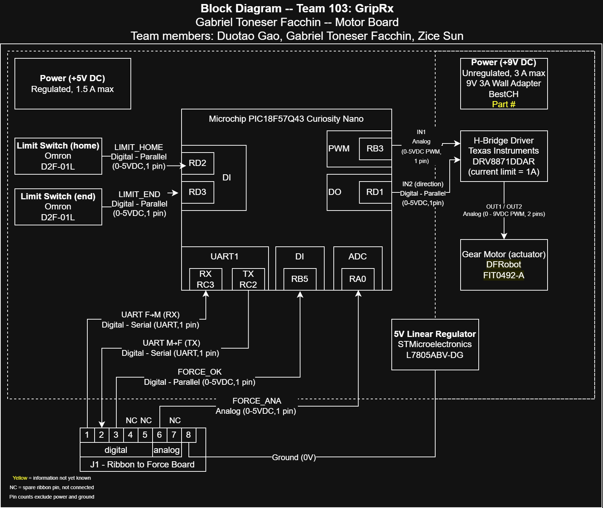

## Overview

The block diagram shows the main electrical components and signal connections for the GripRx motor board. It identifies the power sources, microcontroller inputs and outputs, actuator control, limit switches, and the interface with the Force Board.

The system uses a Microchip PIC18F57Q43 Curiosity Nano as the main microcontroller. Two Omron D2F-01L limit switches provide the home and end position signals to digital inputs RD2 and RD3. The PIC controls the Texas Instruments DRV8871DDAR H-Bridge Driver using a PWM signal from RB3 and a direction signal from RD1. The H-Bridge drives the DFRobot FIT0492-A gear motor.

The motor side is powered by a 9 V, 3 A power supply. A 5 V linear regulator is included for the regulated 5 V supply. Communication with the Force Board is provided through connector J1 using UART, FORCE_OK, FORCE_ANA, and ground connections.

## Motor Board Block Diagram

The completed block diagram for the GripRx motor board is shown below.

